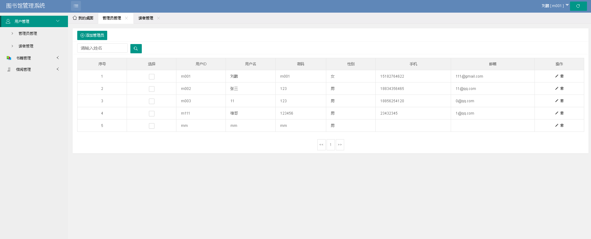
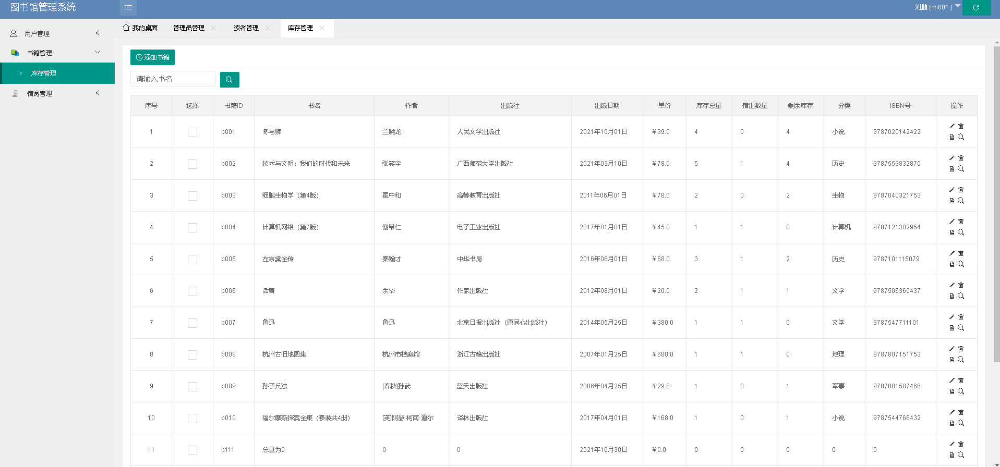
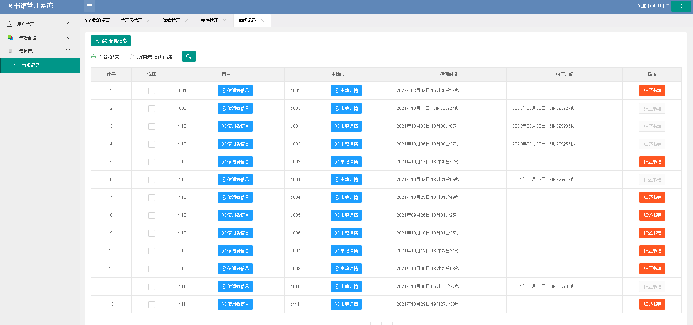

# library_springboot_manage

毕业设计：主题“简单的图书馆信息管理系统”

基于JDK8 + SpringBoot + MySQL8 + MybatisPlus + Maven，前端使用：Thymeleaf

项目完整代码已上传，包含必要代码备注。

数据库私聊获取：

email：xiehdwork@163.com

wx:15349843018

##### 项目部署+指导；论文指导；答辩一对一细节指导......

#### 系统部分截图：

1. 登录页

2. 管理员-用户页面

2. 管理员-书记管理页面

3. 管理员-借阅页面

